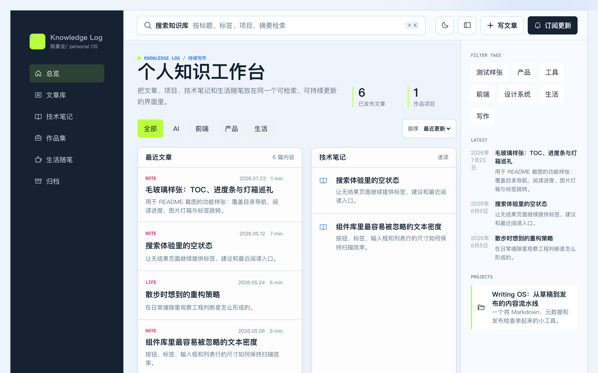
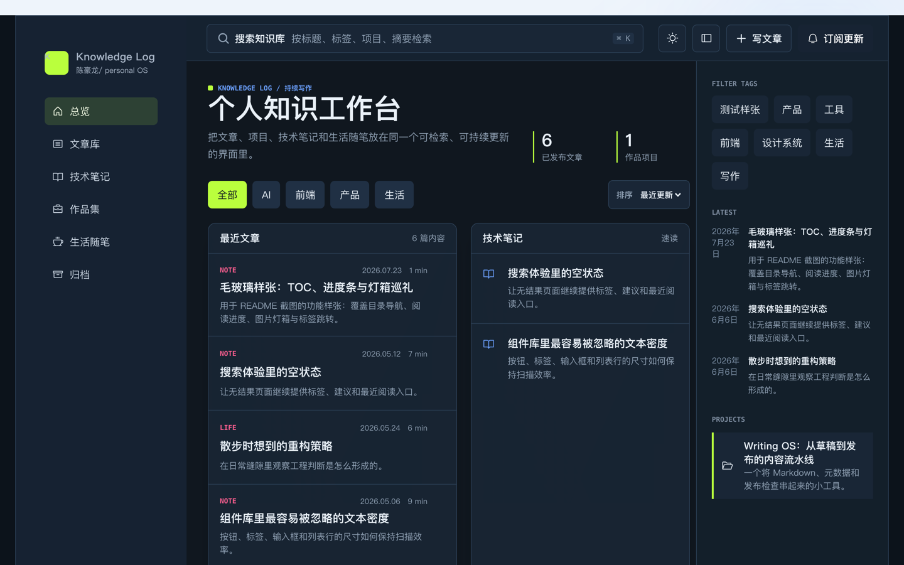
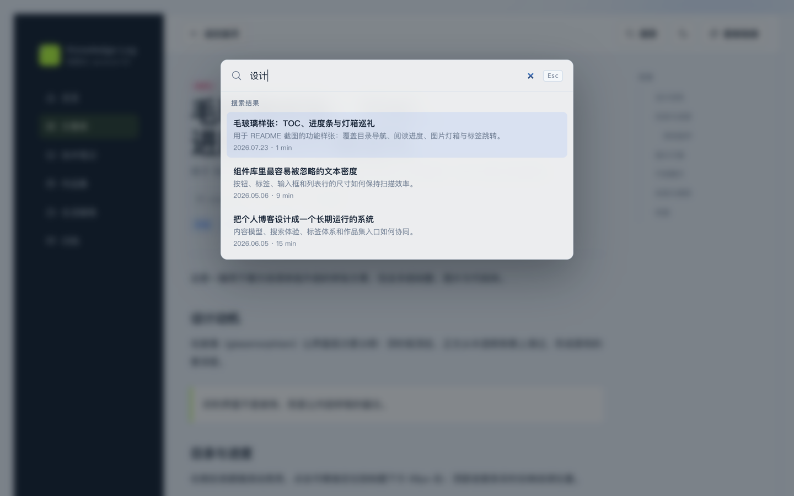
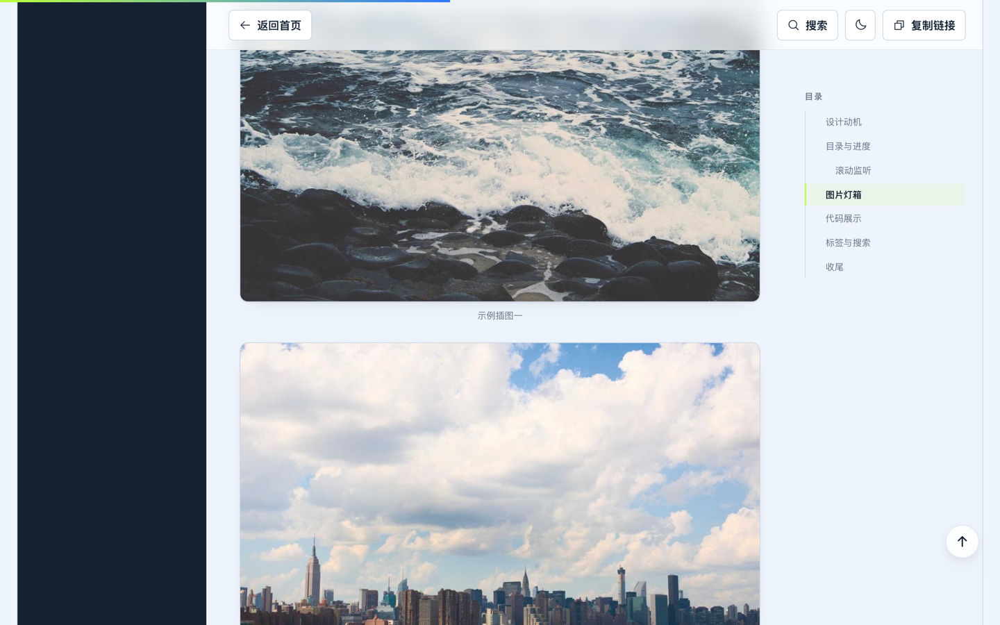
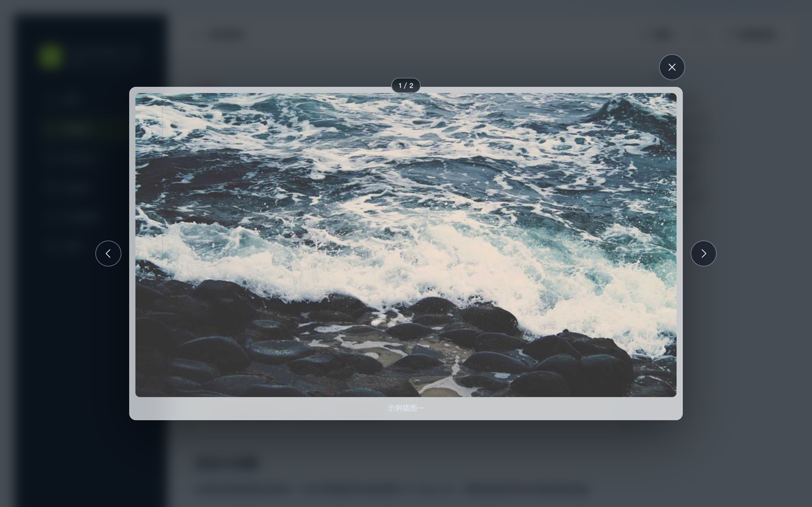
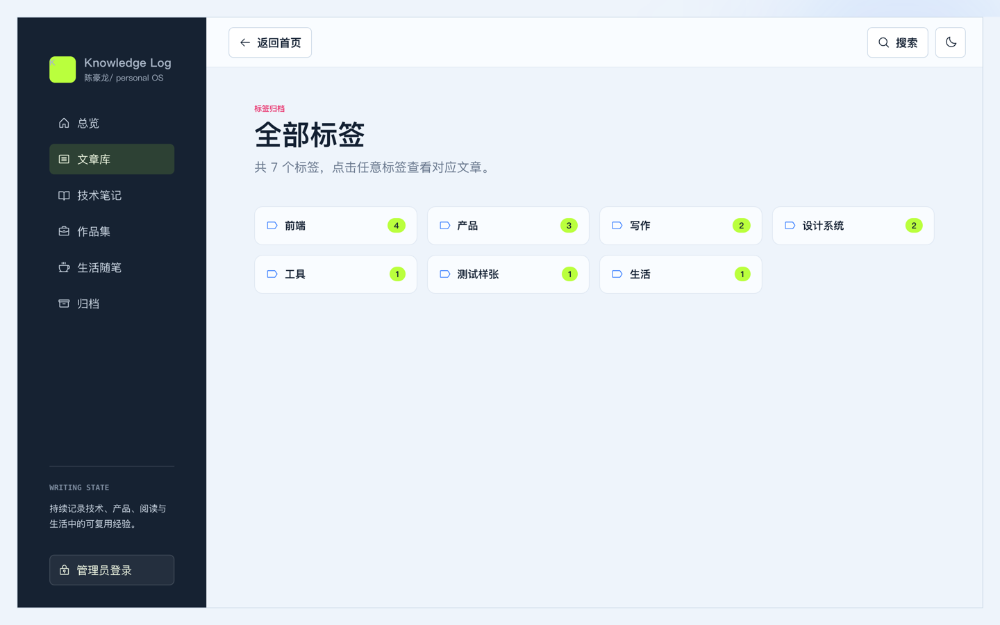

# Knowledge Log

一个前后端分离的个人知识博客。公开端用于阅读、搜索、归档、评论和邮箱订阅；单管理员后台用于写作、发布、归档恢复、修订回溯、评论审核、站点设置、订阅名单与审计。

线上演示：<https://knowledge-log-blog.vercel.app>（RSS：<https://knowledge-log-blog.vercel.app/api/feed>）

## 界面预览

| 浅色主题 | 深色主题 |
| :---: | :---: |
|  |  |

## 功能亮点

### 毛玻璃视觉体系

顶栏吸顶后以 `backdrop-filter` 毛玻璃呈现，正文从半透明背景上滑过形成景深层次；搜索浮层、灯箱、模态框、移动端抽屉与回到顶部按钮均使用同一套玻璃 token（`--glass-bg` / `--glass-blur` / `--glass-border`），并为不支持 `backdrop-filter` 的环境提供不透明回退。深浅两套主题自动切换，偏好写入 localStorage。

### 全局搜索（⌘K）

任意页面按 `⌘K` / `Ctrl+K` 唤起玻璃搜索浮层：200ms 防抖请求后端全文搜索，空输入时展示"最新内容"；支持 `↑↓` 键盘导航、`Enter` 直达文章、`Esc` 关闭，过期响应自动丢弃，不会出现竞态串结果。首页的 `⌘K` 仍聚焦行内搜索框，行为不变。



### 文章目录 + 阅读进度条

长文右侧提供粘性目录（≥1120px 显示），基于与正文渲染器**同一份解析结果**提取标题，scroll-spy 实时高亮当前章节，点击定位精确落在标题下方 96px（`scroll-margin-top`）。顶部 3px 渐变进度条以 `scaleX` 实时反映阅读位置，滚动超过 480px 后右下角出现玻璃"回到顶部"按钮。



### 图片灯箱

点击正文图片即可放大查看：左右方向键 / 按钮切换且首尾环绕，`Esc` 关闭，显示 `1 / N` 计数与图片说明，打开期间锁定 body 滚动。通过事件委托实现，Markdown 渲染器零侵入。



### 标签归档

`/tags` 展示全部标签与文章计数（后端 `json_each` 聚合，仅统计已发布文章），点击任意标签进入 `/tags/:tag` 归档列表，支持分页与直链刷新（SPA 回退已配置）。首页标签云与文章页标签均可点击跳转。



### 评论与订阅

读者可在文章页发表评论（昵称 + 邮箱 + 内容，限流保护），管理员在后台审核 / 隐藏 / 删除；`GET /api/feed` 输出 RSS 2.0 订阅源，`<head>` 内已声明 alternate link。邮箱订阅流程保持：格式校验、主题记录、不可猜测退订令牌和安全退订。

### 写作与内容安全

草稿、发布、下架、归档、恢复、实时预览、本地自动保存和版本冲突保护一应俱全；每次保存生成修订记录，可从历史版本恢复；永久删除只允许已归档文章并要求输入完整标题确认。后台提供文章工作台、评论审核、站点设置、订阅名单、操作审计和 JSON 内容备份。

### SEO 与分享

`og:*` / `twitter:*` 元信息、站点 OG 封面图（`og-image.png`）、RSS alternate link 均已配置，文章页支持复制链接分享。

### 安全

HttpOnly Cookie、会话令牌哈希、Origin 校验、SameSite、登录 / 写入限流、请求体限制、统一错误码和请求 ID。

## 技术架构

```text
personal-blog/
  apps/
    api/src/
      core/             # HTTP、错误、日志、安全、限流、路由
      db/               # libSQL 客户端、迁移（v7）、种子和迁移命令
      modules/          # auth、posts、site（含 /api/tags 统计）、comments、
                        # feed、subscriptions、audit、admin、public（fallback）
      app.js            # API 组合入口
      server.js         # 本地 HTTP 服务
      api.test.js       # 临时数据库上的 16 段 API 流程测试
    web/src/
      app/              # 路由（History API）和通用 hooks
      pages/            # Home、Post、Tag、Login、NotFound
      features/admin/   # 后台页面、写作编辑器与评论审核
      shared/           # PostContent、ArticleToc、ReadingProgress、Lightbox、
                        # SearchOverlay、BackToTop、CommentSection 等共享组件
      App.jsx           # 应用组合入口（全局 ⌘K、浮层挂载）
  api/[...path].js      # Vercel Function 入口
  docs/                 # 架构、迁移、部署说明与界面截图
```

前端为 React 19 + Vite 6 的零依赖自绘路由 SPA；后端为零运行时依赖的 Node 22 原生 HTTP 服务，本地使用 SQLite，生产使用 Turso/libSQL。详细设计见 [架构说明](./personal-blog/docs/ARCHITECTURE.md) 和 [迁移与部署](./personal-blog/docs/MIGRATION_AND_DEPLOYMENT.md)。

## 本地开发

要求 Node.js 22 LTS（`22.x`）。

```bash
npm install
npm run db:migrate
npm run dev
```

- Web：`http://127.0.0.1:5173/`（端口被占用时 Vite 自动顺延）
- API：`http://127.0.0.1:4174/`
- 登录：`http://127.0.0.1:5173/login`

未创建 `.env` 时，本地开发账号为 `admin` / `admin123456`。公网环境不会启用默认账号。

生产或长期使用前，将 `.env.example` 复制为 `.env` 并至少配置：

```dotenv
ADMIN_USERNAME=your-admin-name
ADMIN_PASSWORD=your-strong-password
SESSION_SECRET=a-random-secret-with-at-least-32-characters
```

## 命令

```bash
npm run dev          # 同时启动前端与 API
npm run db:migrate   # 执行待处理迁移并显示版本
npm run test         # 临时数据库上的 16 段 API 流程测试
npm run build        # Vite 生产构建
npm run check        # 测试 + 构建
```

## 数据与备份

- 本地数据库：`apps/api/data/blog.sqlite`
- 初始文章种子：`apps/api/data/content.json`
- 数据库首次迁移及后续版本升级前，会自动生成 `blog.sqlite.backup-<timestamp>`
- 后台"导出备份"会下载文章、站点设置和订阅名单，不包含会话令牌、退订令牌哈希或审计中的敏感内部字段
- 旧 `content.json` 只在文章表为空时导入，不会覆盖已经编辑过的内容

## 部署到 Vercel

项目已连接 GitHub 仓库（`KD-CHL/myblog`），推送到 `main` 分支即自动部署。Vercel 项目 `rootDirectory` 设为 `personal-blog`（应用位于仓库子目录，必须在项目设置中指定，否则构建从仓库根开始会失败）。

Vercel Function 的临时文件系统不作为数据库，生产部署连接 Turso：

1. 在 Vercel Marketplace 为项目安装 Turso Cloud。
2. 确认项目获得 `TURSO_DATABASE_URL` 和 `TURSO_AUTH_TOKEN`。
3. 配置 `ADMIN_USERNAME`、`ADMIN_PASSWORD`、`SESSION_SECRET` 和正式域名对应的 `ALLOWED_ORIGINS`。
4. 部署后访问 `/api/health`，确认 `provider` 为 `turso`、`migrationCurrent` 为 `true`（当前线上即为此状态，迁移版本 v7）。

缺少 Turso 时，公开首页、搜索和文章详情会使用打包的种子文章进入只读模式；登录、订阅和管理写入仍会明确返回 `DATABASE_NOT_CONFIGURED`。系统不会悄悄写入 `/tmp` 并造成数据丢失。

## 主要 API

公开接口：

- `GET /api/health`
- `GET /api/site`
- `GET /api/posts?page=&pageSize=&query=&filter=&nav=&sort=`
- `GET /api/posts/:slug`
- `GET /api/tags` —— 返回 `{ tags, stats }`，`stats` 为带文章计数的标签统计
- `GET /api/posts/:id/comments`、`POST /api/posts/:id/comments`
- `GET /api/feed` —— RSS 2.0 订阅源
- `POST /api/subscriptions`、`POST /api/subscriptions/:id/unsubscribe`

管理员接口：

- `POST /api/auth/login`、`POST /api/auth/logout`、`GET /api/auth/me`
- `POST /api/posts`、`PUT /api/posts/:id`
- `POST /api/posts/:id/archive`、`POST /api/posts/:id/restore`
- `GET /api/posts/:id/revisions`、`POST /api/posts/:id/revisions/:version/restore`
- `GET /api/admin/comments`、`POST /api/admin/comments/:id/approve`、`POST /api/admin/comments/:id/hide`、`DELETE /api/admin/comments/:id`
- `GET /api/admin/dashboard`、`GET|PUT /api/admin/settings`
- `GET /api/admin/subscriptions`、`GET /api/admin/audit`、`GET /api/admin/export`

所有错误响应都包含稳定 `code` 与 `requestId`；文章更新可携带 `version`，冲突时返回 `409 POST_VERSION_CONFLICT`。
