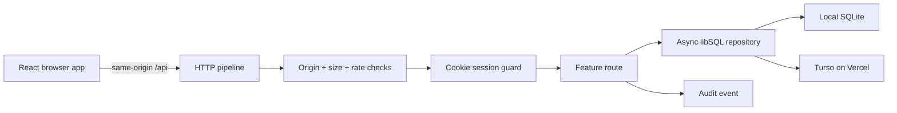

# Architecture

## Product boundary

Knowledge Log is a single-admin publishing system, not a multi-tenant CMS.

Roles:

| Capability | Visitor | Admin |
|---|---:|---:|
| Read/search published posts | Yes | Yes |
| Subscribe/unsubscribe email | Yes | Yes |
| Read drafts and archived posts | No | Yes |
| Create, edit, publish, archive, restore | No | Yes |
| Change site settings and inspect audit | No | Yes |
| Permanently remove archived content | No | Yes, with title confirmation |

Reader accounts, comments, uploads and multi-role permissions are intentionally outside the first production scope.

## Request flow

`apps/api/src/app.js` owns only request orchestration. Domain behavior lives under `modules`, while SQL connection and schema evolution live under `db`.

## Data model

| Table | Purpose |
|---|---|
| `schema_migrations` | Ordered migration history |
| `posts` | Current article state, optimistic `version`, publication and archive timestamps |
| `post_revisions` | Immutable snapshot for every saved version |
| `site_settings` | JSON site configuration under a stable key |
| `subscriptions` | Email/topic/status plus hashed unsubscribe credential |
| `sessions` | Internal ID and hashed cookie token, never the raw new token |
| `audit_events` | Actor, action, entity, request ID and non-sensitive metadata |

`posts.status` remains `draft|published`. Archive is an independent lifecycle dimension through `archived_at`, preserving the previous publication state for restoration.

## API conventions

- Existing `/api` routes remain compatible.
- Lists return `pagination: { page, pageSize, total, totalPages }`.
- Failures return `error: { code, message, statusCode, requestId, details? }`.
- A supplied article `version` is checked in the same write transaction; stale writes return HTTP 409.
- Public queries always require `published` and `archived_at IS NULL`.
- Admin visibility is derived from a valid HttpOnly session cookie, never client storage.

## Security controls

- Raw session and unsubscribe tokens are returned once and stored only as HMAC-SHA256 hashes server-side.
- Cookies use `HttpOnly`, `SameSite=Lax`, and `Secure` in production.
- Mutations reject cross-site Fetch Metadata and unapproved `Origin` values.
- Login, public subscription and authenticated writes have independent in-memory limits.
- JSON bodies are type checked and capped at 1 MiB by default; article fields have domain limits.
- Admin password supports a plain environment secret or `scrypt$<salt>$<hash>`.
- Logs are structured JSON and include request IDs, without passwords, tokens or full IP addresses.

The in-memory limiter is an application-level guard, not a distributed WAF. Production deployments should also enable Vercel Firewall rate limiting for the login endpoint when available.

## Frontend boundaries

- `app`: navigation and cross-page hooks
- `pages`: public page composition
- `features/admin`: authenticated workflows
- `shared/components`: reusable UI without domain data ownership
- `api.js`: the only HTTP client boundary

The frontend keeps a small History API router because the route set is limited and already server-rewritten to `index.html`. Authentication still comes from `/api/auth/me`; a route redirect is user experience, while the API guard is the actual security boundary.
